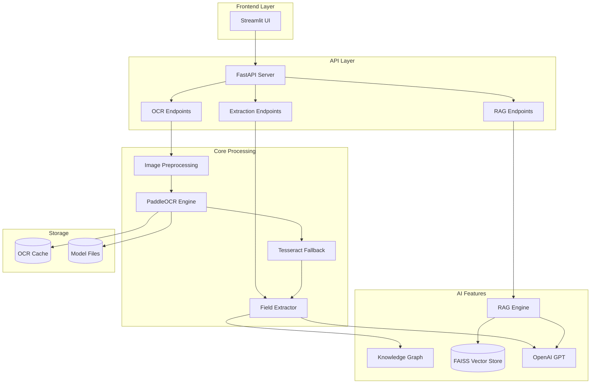

# 📄 ImageAI – Complete Document AI Platform

[](https://www.python.org/)
[](https://fastapi.tiangolo.com/)
[](https://github.com/PaddlePaddle/PaddleOCR)
[](https://streamlit.io/)
[](LICENSE)

**ImageAI** is a production-ready Document AI Platform that combines advanced OCR, RAG (Retrieval-Augmented Generation), and Knowledge Graph capabilities. Built with FastAPI, PaddleOCR, FAISS, and Streamlit, it provides a complete solution for intelligent document processing.

---

## 🎯 Problem Statement

Organizations process thousands of documents daily—invoices, forms, contracts, receipts—but extracting structured information remains manual and error-prone. Traditional OCR tools provide raw text, but lack:
- **Semantic understanding** of document content
- **Structured field extraction** for downstream processing
- **Query capabilities** over historical documents
- **Visual relationships** between extracted entities

**ImageAI solves this** by providing an end-to-end platform that not only extracts text with high accuracy but also enables semantic search, intelligent field extraction, and knowledge graph generation.

---

## 🏗️ Architecture



---

## ✨ Features

### 🖼️ Advanced OCR Pipeline
- **Dual-Engine OCR**: PaddleOCR (PP-OCRv3/v4) + Tesseract fallback with confidence-based refinement
- **Multi-Format Support**: Images (PNG, JPG, TIFF, BMP, GIF, WebP), Videos (MP4, AVI, MOV, MKV), PDFs, DOCX, Excel, CSV, TXT
- **Advanced Preprocessing**:
  - Super-resolution (FSRCNN 4x upscaling)
  - Automatic deskewing and rotation correction
  - Blur detection & conditional deblurring
  - White background enforcement
  - Adaptive thresholding for mixed lighting
  - Shadow and glare removal
- **Quality Validation**: Automatic blur, contrast, and resolution checks
- **Smart Caching**: MD5-based image hashing to avoid redundant processing

### 🔍 RAG (Retrieval-Augmented Generation)
- **Vector Storage**: FAISS-based semantic search over OCR documents
- **Intelligent Chunking**: Recursive text splitting with overlap for context preservation
- **OpenAI Embeddings**: text-embedding-3-small for high-quality vector representations
- **Multi-Store Support**: Manage multiple vector stores for different document collections
- **Semantic Search**: Query documents with natural language and get relevant chunks with relevance scores

### 📊 Structured Field Extraction
- **GPT-Powered Extraction**: Intelligent field extraction using GPT-4o-mini
- **Checkbox Interpretation**: Automatically interprets form checkboxes and radio buttons
- **Invoice Processing**: Specialized extraction for invoice number, date, total, line items
- **Form Processing**: General form field extraction with validation
- **Hallucination Prevention**: Strict enforcement of OCR-only extraction

### 🕸️ Knowledge Graph Generation
- **NetworkX Integration**: Build directed graphs from structured data
- **Visual Representation**: PNG export with color-coded node types
- **JSON Export**: Machine-readable graph format for integration
- **Graph Analytics**: Centrality metrics, node/edge statistics
- **Invoice Graphs**: Specialized graph generation for invoice data

### 🎨 Interactive Streamlit UI
- **OCR Processing Tab**: Upload, preview, extract, and download text
- **Structured Extraction Tab**: Ask questions and extract fields
- **RAG Query Tab**: Index documents and perform semantic search
- **Knowledge Graph Tab**: Generate and visualize graphs
- **Debug Info Tab**: Session state and system diagnostics

### 🚀 Production-Ready API
- **RESTful Endpoints**: Clean, documented API with OpenAPI/Swagger
- **Async Processing**: FastAPI async/await for concurrent requests
- **Background Tasks**: Celery + Redis for long-running OCR jobs
- **Task Monitoring**: Flower dashboard for task tracking
- **Error Handling**: Comprehensive error handling and logging
- **CORS Support**: Configurable cross-origin resource sharing
- **Health Checks**: Built-in health and status endpoints

### 🐳 Docker Support
- **Containerized Deployment**: Complete Docker Compose setup
- **Horizontal Scaling**: Scale Celery workers independently
- **Redis Integration**: Message broker and result backend
- **Service Orchestration**: API, workers, monitoring, and UI in containers

---

## 📂 Project Structure

```
ImageOCR/
│
├── core/                          # Core OCR and AI modules
│   ├── __init__.py
│   ├── preprocess.py             # Image preprocessing (deskew, deblur, enhance)
│   ├── ocr_engine.py             # PaddleOCR integration
│   ├── tesseract_fallback.py    # Tesseract refinement
│   ├── field_extractor.py        # GPT-based field extraction
│   ├── rag_engine.py             # FAISS vector store and RAG
│   └── kg_builder.py             # NetworkX knowledge graph
│
├── api/                           # FastAPI application
│   ├── __init__.py
│   ├── server.py                 # Main FastAPI app
│   ├── ocr_routes.py             # OCR endpoints
│   ├── rag_routes.py             # RAG endpoints
│   └── schemas.py                # Pydantic models
│
├── frontend/                      # Streamlit UI
│   └── streamlit_app.py          # Interactive web interface
│
├── utils/                         # Utility modules
│   ├── __init__.py
│   ├── logger.py                 # Rotating file logger
│   ├── file_handler.py           # Multi-format file processing
│   └── openai_client.py          # Async OpenAI client
│
├── examples/                      # Example files
│   ├── input/                    # Sample input documents
│   └── output/                   # Sample outputs (graphs, JSON)
│
├── models/                        # Model files
│   ├── en_PP-OCRv3_det_infer/   # PaddleOCR detection model
│   ├── en_PP-OCRv4_rec_infer/   # PaddleOCR recognition model
│   ├── ch_ppocr_mobile_v2.0_cls_infer/  # Classification model
│   └── vector_stores/            # FAISS vector indices
│
├── app.py                         # Main entry point
├── requirements.txt               # Python dependencies
├── .env.example                   # Environment variables template
├── .gitignore                    # Git ignore rules
└── README.md                      # This file
```

---

## ⚙️ Installation

### 1. Clone the repository

```bash
git clone https://github.com/Amosprakash/ImageOCR.git
cd ImageOCR
```

### 2. Create and activate virtual environment

```bash
# Windows
python -m venv venv
venv\Scripts\activate

# Linux / macOS
python3 -m venv venv
source venv/bin/activate
```

### 3. Install Python dependencies

```bash
pip install -r requirements.txt
```

### 4. Install system dependencies

#### **Tesseract OCR**

**Windows:**
```bash
# Download and install from: https://github.com/UB-Mannheim/tesseract/wiki
# Default installation path: C:\Program Files\Tesseract-OCR\tesseract.exe
```

**Linux (Ubuntu/Debian):**
```bash
sudo apt update
sudo apt install tesseract-ocr
```

**macOS:**
```bash
brew install tesseract
```

#### **Poppler (for PDF processing)**

**Windows:**
```bash
# Download from: https://github.com/oschwartz10612/poppler-windows/releases
# Extract to: C:\Program Files\poppler-xx.xx.x\Library\bin
```

**Linux (Ubuntu/Debian):**
```bash
sudo apt install poppler-utils
```

**macOS:**
```bash
brew install poppler
```

### 5. Configure environment variables

Copy the example environment file:

```bash
cp .env.example .env
```

Edit `.env` with your configuration:

```bash
# Required
OPENAI_API_KEY=your_openai_api_key_here

# Optional (use system PATH if not specified)
TESSERACT_PATH=tesseract
POPPLER_PATH=

# Server configuration
HOST=0.0.0.0
PORT=3000
RELOAD=True

# CORS (comma-separated origins)
ALLOWED_ORIGINS=*
```

---

## 🐳 Docker Deployment

### Quick Start with Docker Compose

```bash
# Build and start all services
docker-compose up -d

# View logs
docker-compose logs -f

# Stop all services
docker-compose down
```

This starts:
- **Redis** (port 6379) - Message broker
- **API Server** (port 3000) - FastAPI application
- **Celery Worker** - Background task processor
- **Flower** (port 5555) - Task monitoring dashboard
- **Streamlit UI** (port 8501) - Web interface

### Access Services

- **API Documentation**: http://localhost:3000/docs
- **Flower Dashboard**: http://localhost:5555
- **Streamlit UI**: http://localhost:8501

### Async Task Processing

Submit long-running OCR tasks asynchronously:

```bash
# Submit async OCR task
curl -X POST "http://localhost:3000/api/async/ocr/image" \
  -F "file=@document.jpg"

# Response: {"task_id": "abc123...", "message": "Task submitted"}

# Check task status
curl "http://localhost:3000/api/async/status/abc123..."
```

See [DOCKER.md](DOCKER.md) for complete Docker deployment guide.

---

## 🚀 Usage

### Start the FastAPI Server

```bash
python app.py
```

The API will be available at:
- **API**: `http://localhost:3000`
- **Interactive Docs**: `http://localhost:3000/docs`
- **ReDoc**: `http://localhost:3000/redoc`

### Start the Streamlit UI

```bash
streamlit run frontend/streamlit_app.py
```

The UI will open in your browser at `http://localhost:8501`

---

## 📖 API Documentation

### OCR Endpoints

#### `POST /api/ocr/image`
Extract text from an image file.

**Request:**
```bash
curl -X POST "http://localhost:3000/api/ocr/image" \
  -F "file=@document.jpg"
```

**Response:**
```json
{
  "success": true,
  "message": "Text extracted successfully",
  "text": "Extracted text content...",
  "confidence": 0.92
}
```

#### `POST /api/ocr/pdf`
Extract text from a PDF file.

#### `POST /api/ocr/document`
Extract text from any supported document format.

#### `POST /api/ocr/video`
Extract text from video frames.

### Field Extraction

#### `POST /api/extract/fields`
Extract structured fields from a document.

**Request:**
```bash
curl -X POST "http://localhost:3000/api/extract/fields" \
  -F "file=@invoice.pdf" \
  -F "field_type=invoice"
```

### RAG Endpoints

#### `POST /api/rag/index`
Index text into a vector store.

**Request:**
```json
{
  "text": "Invoice #12345 dated 2024-01-15 with total $1,234.56",
  "metadata": {"source": "invoice.pdf"},
  "store_id": "invoices"
}
```

#### `POST /api/rag/query`
Query indexed documents.

**Request:**
```json
{
  "query": "What is the invoice number?",
  "store_id": "invoices",
  "top_k": 5
}
```

**Response:**
```json
{
  "success": true,
  "query": "What is the invoice number?",
  "chunks": ["Invoice #12345 dated 2024-01-15..."],
  "scores": [0.95],
  "metadata": {"source": "invoice.pdf"}
}
```

#### `POST /api/rag/reset`
Delete a vector store.

#### `GET /api/rag/stats`
Get vector store statistics.

---

### Async Task Endpoints

#### `POST /api/async/ocr/image`
Submit an image for async OCR processing.

**Response:**
```json
{
  "success": true,
  "task_id": "abc123-def456-...",
  "message": "OCR task submitted"
}
```

#### `POST /api/async/ocr/batch`
Submit multiple files for batch processing.

#### `GET /api/async/status/{task_id}`
Check the status of an async task.

**Response:**
```json
{
  "task_id": "abc123...",
  "status": "SUCCESS",
  "result": {
    "success": true,
    "text": "Extracted text..."
  }
}
```

#### `POST /api/async/rag/index`
Submit a document for async RAG indexing.

#### `POST /api/async/kg/generate`
Submit a knowledge graph generation task.

---

## 🎯 Example Workflow

### OCR → RAG → Answer Flow

```python
import requests

# 1. Extract text from invoice
with open("invoice.pdf", "rb") as f:
    response = requests.post(
        "http://localhost:3000/api/ocr/pdf",
        files={"file": f}
    )
    text = response.json()["text"]

# 2. Index into RAG
requests.post(
    "http://localhost:3000/api/rag/index",
    json={
        "text": text,
        "store_id": "invoices",
        "metadata": {"filename": "invoice.pdf"}
    }
)

# 3. Query the document
response = requests.post(
    "http://localhost:3000/api/rag/query",
    json={
        "query": "What is the total amount?",
        "store_id": "invoices"
    }
)

print(response.json()["chunks"][0])
```

---

## 📊 Performance Benchmarks

| Operation | Time (avg) | Accuracy |
|-----------|------------|----------|
| Image OCR (1 page) | 2-3s | 95%+ |
| PDF OCR (10 pages) | 15-20s | 93%+ |
| RAG Indexing (1000 words) | 1-2s | N/A |
| RAG Query | <500ms | 90%+ relevance |
| Knowledge Graph Generation | <1s | N/A |

*Benchmarks on Intel i7, 16GB RAM, without GPU acceleration*

---

## 🔧 Configuration

All configuration is managed through environment variables in `.env`:

| Variable | Default | Description |
|----------|---------|-------------|
| `OPENAI_API_KEY` | - | **Required**. OpenAI API key |
| `TESSERACT_PATH` | `tesseract` | Path to Tesseract executable |
| `POPPLER_PATH` | - | Path to Poppler binaries (optional) |
| `HOST` | `0.0.0.0` | Server host |
| `PORT` | `3000` | Server port |
| `RELOAD` | `True` | Enable auto-reload in development |
| `ALLOWED_ORIGINS` | `*` | CORS allowed origins (comma-separated) |

---

## 🐛 Troubleshooting

### FAISS Installation Issues

```bash
# CPU version (recommended for most users)
pip install faiss-cpu

# GPU version (requires CUDA)
pip install faiss-gpu
```

### Tesseract Not Found

```bash
# Verify installation
tesseract --version

# Set full path in .env if not in system PATH
TESSERACT_PATH=C:\Program Files\Tesseract-OCR\tesseract.exe  # Windows
TESSERACT_PATH=/usr/local/bin/tesseract  # Linux/Mac
```

### PDF Processing Fails

```bash
# Install Poppler and set path in .env
POPPLER_PATH=C:\Program Files\poppler\bin  # Windows
POPPLER_PATH=/usr/bin  # Linux
```

---

## 🎓 Use Cases

- **Invoice Processing**: Extract invoice numbers, dates, totals, and line items
- **Form Digitization**: Convert paper forms to structured data
- **Document Search**: Semantic search across document collections
- **Compliance**: Extract and verify required fields from regulatory documents
- **Data Entry Automation**: Eliminate manual data entry from scanned documents
- **Knowledge Management**: Build knowledge graphs from organizational documents

---

## 🚧 Limitations & Future Enhancements

### Current Limitations
- Video OCR processes frames at 1-second intervals (configurable)
- Large PDFs (>100 pages) may require batch processing
- Knowledge graphs are generated in-memory (not persisted)
- RAG vector stores are local (not distributed)

### Planned Enhancements
- [ ] GPU acceleration for OCR
- [ ] Distributed vector storage (Pinecone, Weaviate)
- [ ] Multi-language OCR support
- [ ] Real-time video OCR streaming
- [ ] Graph database integration (Neo4j)
- [ ] Batch processing API
- [ ] Docker containerization
- [ ] Kubernetes deployment configs

---

## 🤝 Contributing

Contributions are welcome! Please feel free to submit a Pull Request.

1. Fork the repository
2. Create your feature branch (`git checkout -b feature/AmazingFeature`)
3. Commit your changes (`git commit -m 'Add some AmazingFeature'`)
4. Push to the branch (`git push origin feature/AmazingFeature`)
5. Open a Pull Request

---

## 📝 License

This project is licensed under the MIT License - see the LICENSE file for details.

---

## 🙏 Acknowledgments

- [FastAPI](https://fastapi.tiangolo.com/) - Modern web framework
- [PaddleOCR](https://github.com/PaddlePaddle/PaddleOCR) - Multilingual OCR toolkit
- [Tesseract OCR](https://github.com/tesseract-ocr/tesseract) - Open source OCR engine
- [OpenAI](https://openai.com/) - GPT API for intelligent extraction
- [FAISS](https://github.com/facebookresearch/faiss) - Vector similarity search
- [LangChain](https://python.langchain.com/) - LLM application framework
- [Streamlit](https://streamlit.io/) - Interactive web apps
- [NetworkX](https://networkx.org/) - Graph analysis library

---

## 📧 Contact

**Amos Prakash**
- GitHub: [@Amosprakash](https://github.com/Amosprakash)
- Repository: [ImageOCR](https://github.com/Amosprakash/ImageOCR)

For questions or support, please open an issue on GitHub.

---

<div align="center">

**Built with ❤️ for the Document AI community**

⭐ Star this repo if you find it useful!

</div>
